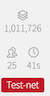
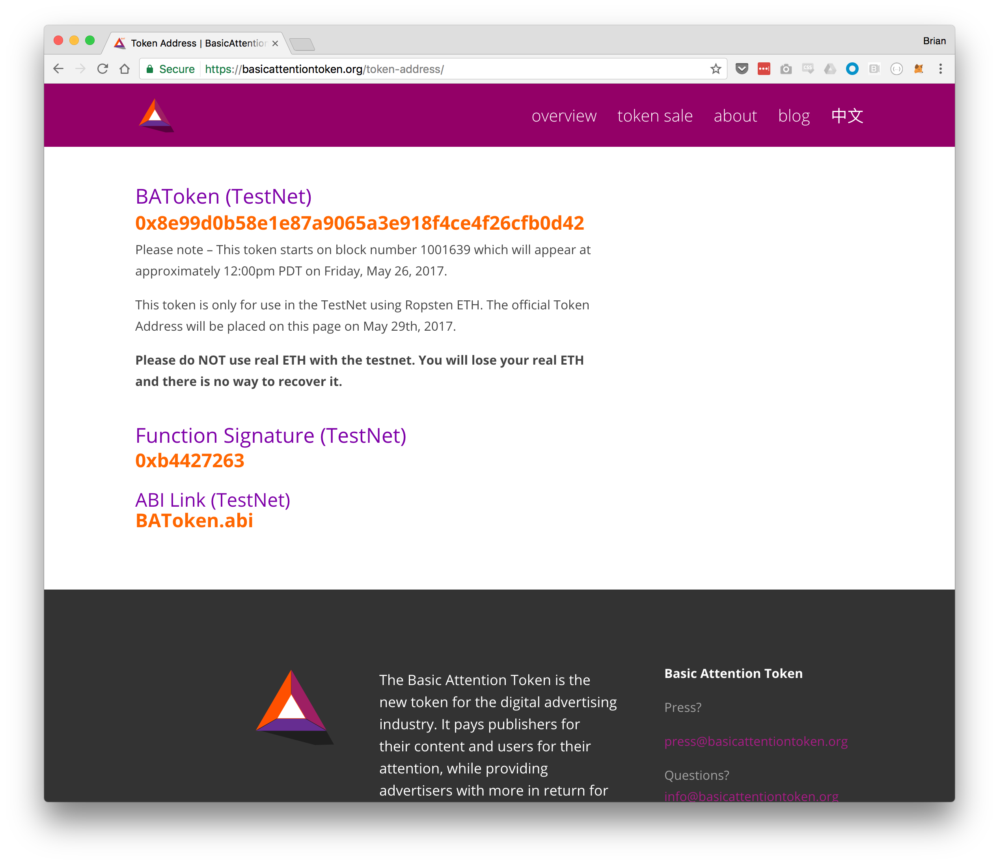
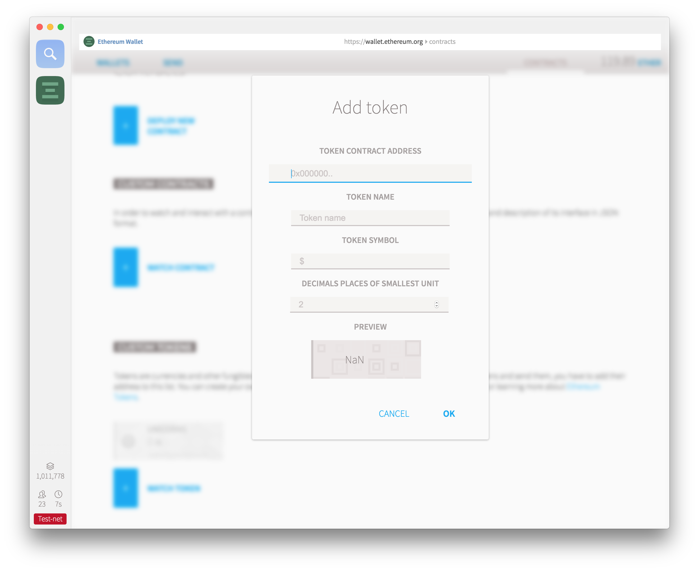
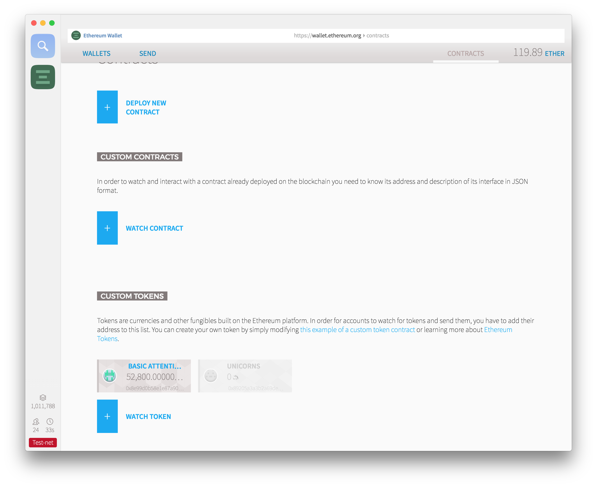
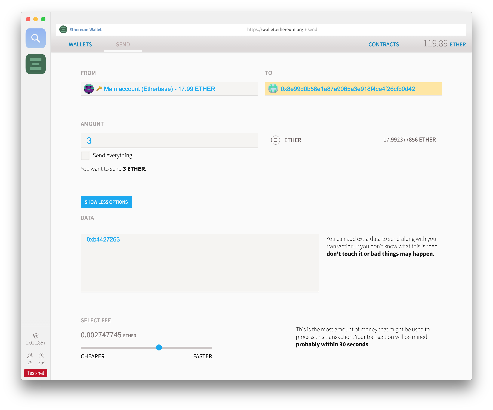
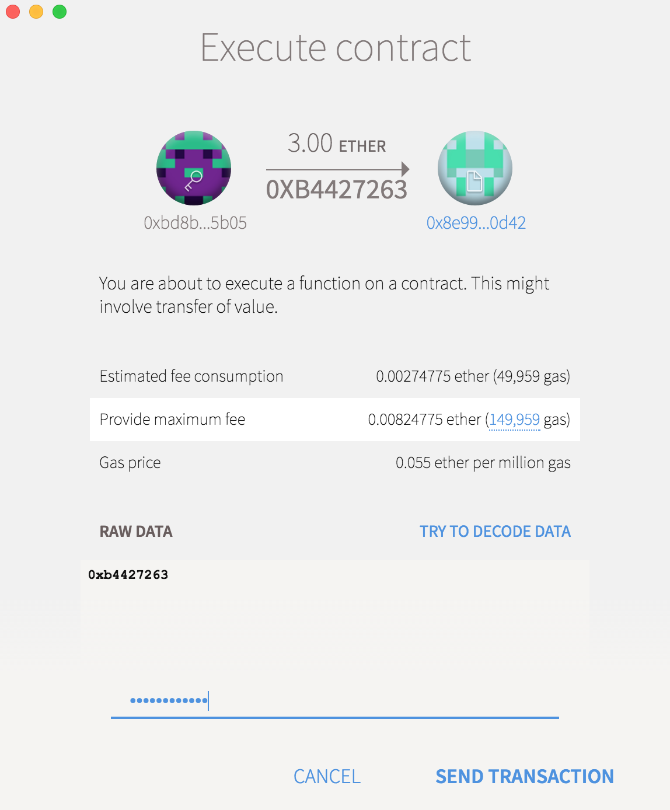
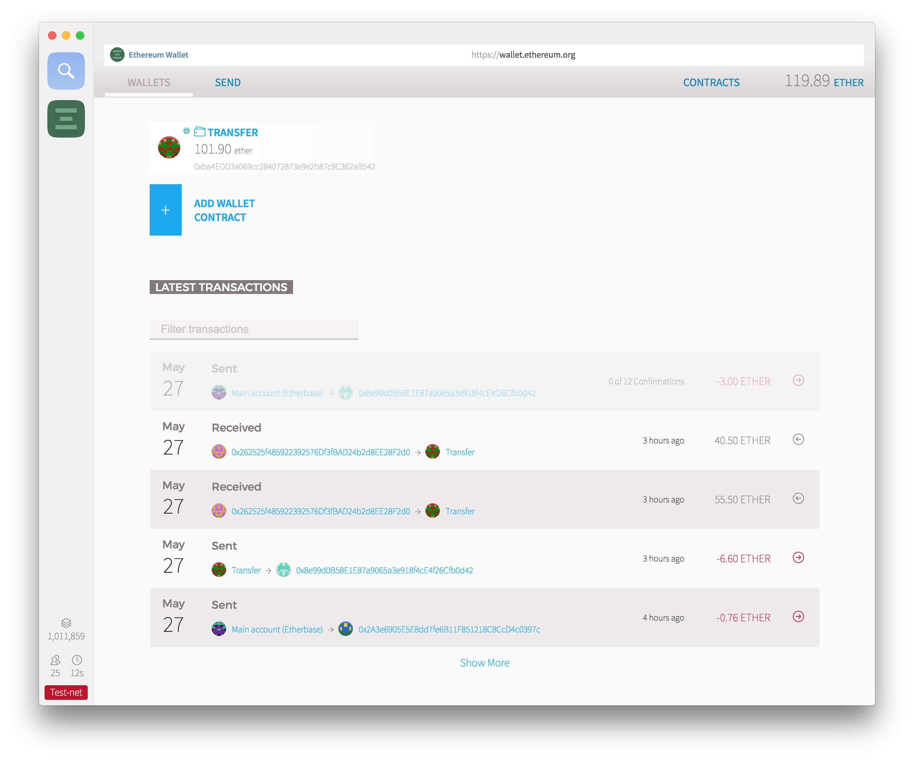

# TEST!! Basic Attention Token (BAT) Test tokens

!! **I cannot make this clearer: do this on the testnet or you
will lose your ether.**

**When I tested this the evening of 2017-May-27, I couldn't get it to work.
Looking at the contract, I _think_ they ran out of test tokens, but not sure.
This may still have value when buying the real thing though.**

1. Start up Mist Browser.
1. Switch over to the test network. (Develop->Network->Testnet). Let that sync up if you haven't visited before.
1. Get yourself some test ether. If you know me, ping me with your **testnet** wallet address and I'll send you some.
1. Triple-check that you're on the testnet by looking in bottom lefthand corner.

1. Visit https://basicattentiontoken.org/token-address/ in your favorite web browser. It will look something like this:

1. Copy the BAToken (TestNet) address to clipboard.
1. In Mist, click on Contracts and then Watch Token.

1. Paste in the BAToken (TestNet) into the Token Contract Address. The other fields should fill in automatically.
Click OK. At this point you should see Basic Attention under Custom Tokens and a zero balance (_disregard the coin in my screenshot_). Now we're ready to see the tokens once we purchase them.

1. Now go to Wallets. Choose the Account you want to send ether from.
1. Choose Send Funds.
1. For the To: address, paste in the BAToken (Testnet) address from the https://basicattentiontoken.org/token-address/  page.
1. For Amount:, send whatever test ether you're comfortable with. It might be a good time to look at the bottom lefthand corner of the screen and confirm that you're on the testnet.
1. Click Show More Options.
1. In the Data field, paste the Function Signature (Testnet) from the https://basicattentiontoken.org/token-address/  page.
1. Slide the fee so it's >0.002. So overall you end up with something like:

1. Type your password on the next screen, then send.

1. Under Wallets, scroll down and you should see the transaction sent.

1. Now we wait. Give it a few minutes to execute.
